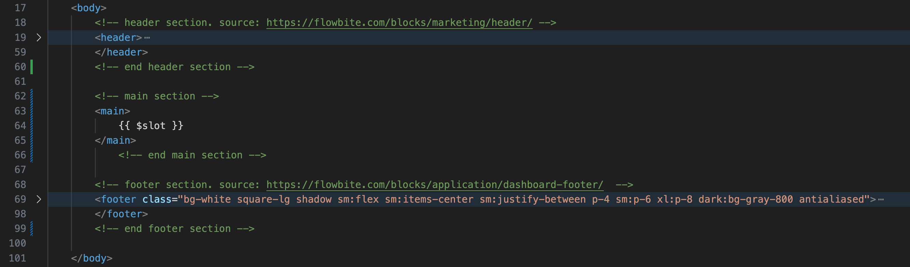

# PROJECT: Personal Website Project 
This PROJECT_README contains notes, comments, source links, etc. used while buiding this personal website project with PHP and Laravel. 

## Development Environment
MacBook Air
MacOS Sonoma 14.4
VSCode 1.88.0 (Universal)
PHP 8.3.4
Laravel Installer 5.7.0
SQLite

## Steps (and substeps)
### Step 1: Setup the project
1. Create a grandparent directory for the project: `mkdir website-tutorial-laravelnews`. Open this new directory using VSCode.
2. Create a README.md file in the parent directory for capturing notes, etc. That's this file.    
3. From the VSCode Terminal, create a personal website project using Laravel: `laravel new personal-site2 --git --pest`. Pest is a Testing Framework. Choose "No starter kit", then "SQLlite" at the prompts.
4. After the Laravel project is created, open the `/personal-site2/composer.json` file and update the PHP version in the "require" section. Use the `php -v` command to get the version. 
5. Once file changes are saved, from the VSCode terminal, run: `composer update` to update the dependency list. Then run `composer bump` to update the dependencies to the latest versions. Then run `composer update` again to account for dependency changes.
5. Create a new termimal window in VSCode named "artisan", cd into "personal-site2" directory, and run: `php artisan serve` to spin up the php web server. Leave this terminal running and use the original terminal window for future command line actions. 
6. Open `http://localhost:8000/` in a browser to confirm the Laraval v8.3 landing page is displayed. When needed, use Ctrl+C, _not_ Command+C, to stop the php web server.
7. Now commit changes to GitHub 

### Step 2: Add Tailwind CSS
1. Remove ` "axios": "^1.6.4",` from `package.json` file
2. Remove ` "./resources/**/*.js", "./resources/**/*.vue",` from `tailwind.config.js` file
3. Then, onto step 2, "Install Tailwind CSS" instructions on https://tailwindcss.com/docs/guides/laravel by running this in the terminal: `npm install -D tailwindcss postcss autoprefixer`, then `npx tailwindcss init -p`
4. Onto step 3, "Configure Template paths". Replace code in `tailwind.config.js` with code from [instruction page](https://tailwindcss.com/docs/guides/laravel). 
5. Onto step 4, "Add the Tailwind directives to your CSS" by copying the code into the `/resources/css/app.css` file.
6. Onto step 5, "Start your build process" by running this in the terminal: `npm run dev`
7. This previous step will start the laravel server, so this terminal is locked by the npm process. Rename the terminal tab to "npm" and create a new tab named "zsh"
8. Open browser to confirm `http://localhost:8000/` is still loading. If so, now npm dev server are vite (javascript build tool) are running. 
9. Now commit changes to GitHub. [Timestamp 10:20]

### Step 3: Focus on routes and resources (stylesheets, javascripts, blade views). Add home page
1. Open `/resources/views/welcome.blade.php` and replace all 3 lines below "Styles Section" comment with: `@vite(['resources/css/app.css', 'resources/js/app.js'])`
2. At this point, I deviated from the tutorial and replaced all of the `welcome.blade.php` "body" content with the "body" content from `temp.html` which was built using header, footer, and hero components from https://flowbite.com/blocks 
3. Now, reload the site and it looks very different.
4. Commit changes to GitHub [Timestamp 12:05]
5. Next, switch from using layouts to components. Start by creating `/components` and `/pages` folders underneath `resources/views/`. 
6. Add a `layout.blade.php` file to the `/components` folder and copy all content from `welcome.blade.php` into `layout.blade.php`
7. Replace all of the content in `welcome.blade.php` with this: x-layout tag. p-tag you can't see me. endp-tag. endx-layout-tag
8. update `web.php` file. See [Timestamp 16:20]
9. Add a `home.blade.php` file to the `/pages` folder and copy all content from `welcome.blade.php` into `home.blade.php`. Delete `welcome.blade.php`. Site will be broken temporarily.
10. Now update the route in `web.php` like this `Route::view('/', 'pages.home')->name('home');` Site should be working again. [Timestamp 17:45]

### Step 4: Add blog and about blade pages then start customizing layout.blade.php with Tailwind CSS UI components  
1. Update the `web.php` file with the new routes and create  new `blog.blade.php` and `about.blade.php` files [Timestamp 19:26]
2. Replace the entire body tag in `layout.blade.php` with "{{ $slot }}". Confirm the update to the site in the browser.  [Timestamp 20:00] 
3. Now, revert the `layout.blade.php` file. Essentially, back to Step 3.2  
4. At this point in the tutorial [Timestamp 23:00], the author all of the sub-sections in "main". Leaving only the header, footer, and main sections. I updated the main section to embed the "slot" variable. Now "main" looks like this => . 
5. Now, to update the `home.blade.php` page by pasting all of the content inside the temp.html file "main" section between the "x-layout" tags [Timestamp 26:00]
6. Commit to GitHub. [Timestamp 26:10]

### Step 5: Make site dynamic 
1. Modify `home.blade.php` with my name and a greeting. (see updated file)
2. Commit to GitHub. [Timestamp 28:50] 

